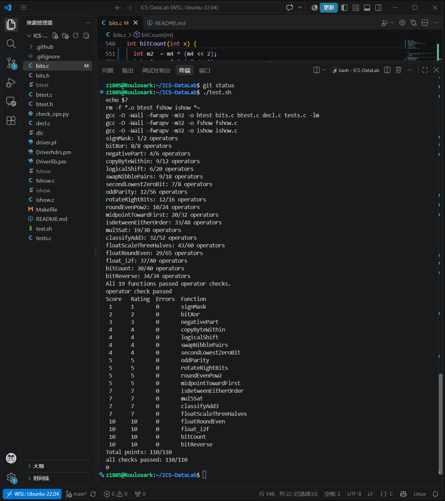

# Lab1: DataLab 实验报告

**姓名：** 周哲锐  
**学号：** 25300180070  

## 1. 实验目的

本实验通过受限的整数运算和 IEEE 754 单精度浮点数位级操作，练习二进制补码、位运算、掩码、移位、整数溢出以及浮点数舍入等内容。

本实验仅修改 `bits.c` 中 P1–P19 的函数体，并通过 `check_ops.py` 检查运算符使用是否合法，通过 `btest` 检查函数实现是否正确。

---

## 2. 实验结果

最终运行：

```bash
./test.sh
echo $?
```

全部 19 个函数均通过运算符检查和正确性测试，最终得分：

```text
Total points: 110/110
all checks passed: 110/110
```

脚本返回状态码为：

```text
0
```

测试结果如下：



---

## 3. 各题实现思路

### P1 `signMask`

目标是构造只有最高位为 `1`、其余位均为 `0` 的 32 位掩码。

常数 `1` 的最低位为 `1`，将其向左移动 31 位即可将这一位移动到最高位，得到 `0x80000000`。

核心思路：

```text
1 << 31
```

---

### P2 `bitXor`

异或在两个 bit 不同时为 `1`，因此可以拆成两种情况：

```text
x = 0, y = 1
x = 1, y = 0
```

分别可以表示为：

```text
~x & y
x & ~y
```

最初考虑将两部分直接用 `&` 连接，但这要求两种互斥情况同时成立，因此不正确。

实际上应当将两种情况进行逻辑“或”。由于本题只允许使用 `~` 和 `&`，因此利用德摩根律：

```text
A | B = ~(~A & ~B)
```

最终只使用 `~` 和 `&` 实现异或。

---

### P3 `negativePart`

本题要求当 `x < 0` 时返回 `-x`，否则返回 `0`。

首先利用算术右移：

```text
x >> 31
```

生成符号掩码：

```text
x >= 0 -> 0x00000000
x < 0  -> 0xFFFFFFFF
```

同时根据二进制补码：

```text
-x = ~x + 1
```

将 `~x + 1` 与符号掩码进行按位与。如果 `x` 非负，结果会被全部清零；如果 `x` 为负，则全 1 的 mask 会保留 `-x`。

---

### P4 `copyByteWithin`

32 位整数由 4 个 byte 组成，其起始 bit 分别为：

```text
0, 8, 16, 24
```

因此第 `src` 个 byte 的起始位置可以用：

```text
src << 3
```

得到。

首先将源 byte 右移到最低 8 位，再通过 `0xFF` 提取。

然后构造目标 byte 的 mask，将 `dst` 位置原有的 8 位清零。

最后将提取出的源 byte 左移到 `dst` 对应位置，并通过按位或写入。

整体过程为：

```text
提取 src byte
-> 清空 dst byte
-> 将 src byte 移动到 dst
-> OR 合并
```

---

### P5 `logicalShift`

C 中有符号整数右移使用算术右移，因此负数右移时高位会补 `1`。

本题要求实现逻辑右移，也就是高位补 `0`。

首先正常进行：

```text
x >> n
```

然后需要构造：

```text
高 n 位为 0
低 32-n 位为 1
```

的掩码。

最初考虑逐位移动并累加 `1` 来构造这个 mask，但这样会使用过多运算符。

随后利用最高位的 `1` 经过算术右移会不断补 `1` 的特点，一次产生高 n 位为 `1` 的模式，再进行左移和取反，得到所需 mask。

最后与 `x >> n` 按位与，将算术右移产生的高位 `1` 清除。

---

### P6 `swapNibblePairs`

每个 byte 可以分成两个 4-bit 的 nibble：

```text
高 4 位 | 低 4 位
```

本题要求交换每个 byte 内的这两个 nibble。

从 `0x0F` 出发，通过移位和按位或逐步构造：

```text
0x0F0F0F0F
```

作为低 4 位的 mask。

使用该 mask 提取每个 byte 的低 4 位并左移 4 位；同时将原数右移 4 位，再使用同一个 mask 保留原来的高 4 位。

最后将两部分按位或，即完成每个 byte 内高低 nibble 的交换。

---

### P7 `secondLowestZeroBit`

首先对 `x` 取反，使原来所有的 `0` 都变为 `1`。

对于整数 `y`：

```text
y & (~y + 1)
```

可以只保留最低位的 `1`。

为了寻找第二低的 `1`，先将最低位的 `1` 清除。具体做法是得到最低位 `1` 的位置 mask 后，对其取反并与原数按位与，从而只把该位置变成 `0`。

也可以利用经典形式：

```text
y & (y - 1)
```

直接清除最低位的 `1`。

由于本题不能直接使用减法，因此使用允许的补码运算构造。

清除最低位的 `1` 后，再次提取最低位的 `1`，得到的就是原始 `x` 中第二低的 `0` 所对应的位置。

---

### P8 `oddParity`

奇偶校验只关心一个整数中 `1` 的数量是奇数还是偶数。

异或具有如下性质：

```text
偶数个 1 XOR 后结果为 0
奇数个 1 XOR 后结果为 1
```

因此不需要逐位统计，而是采用不断折半的方法：

```text
32 bit
-> 16 bit
-> 8 bit
-> 4 bit
-> 2 bit
-> 1 bit
```

每一步将当前值和右移一半后的值进行 XOR，从而将不同区域的奇偶信息不断合并。

最终最低位就表示原始 32 位中 `1` 数量的奇偶性，再取逻辑非即可得到题目要求的 odd parity bit。

---

### P9 `rotateRightBits`

循环右移与普通右移不同：从右侧移出的 bit 需要重新放回左侧。

由于 32 位整数循环移动 32 位会回到原值，因此实际移动量只需要：

```text
n & 31
```

即按 32 取模。

结果可以分为两部分：

```text
逻辑右移得到的部分
+
从右端移出并重新进入左侧的部分
```

其中逻辑右移部分复用了 P5 中构造 mask 的方法。

另外一部分通过左移到高位，再与逻辑右移结果进行按位或，得到最终循环右移结果。

---

### P10 `roundEvenPow2`

本题要求将非负整数舍入到最近的 `2^n` 倍数，并在正好处于两个倍数中间时采用 round-to-even。

先令：

```text
q = x >> n
```

得到较小倍数对应的商。

普通四舍五入可以通过增加半个区间宽度实现，但对于正好 halfway 的情况，需要根据 `q` 的奇偶性判断是否进位。

因此使用：

```text
2^(n-1) - 1 + (q & 1)
```

作为 bias。

当 `q` 为偶数时，正好 halfway 不会进位；当 `q` 为奇数时，会进位到下一个偶数商。

最后通过右移 `n` 位再左移 `n` 位，得到最终的 `2^n` 倍数。

---

### P11 `midpointTowardFirst`

直接计算：

```text
(x + y) / 2
```

可能导致整数溢出，因此不能直接计算 `x+y`。

利用：

```text
x + y = 2 * (x & y) + (x ^ y)
```

可以写出：

```text
(x & y) + ((x ^ y) >> 1)
```

从而避免直接求和。

如果数学中点恰好位于两个整数中间，题目要求选择更接近第一个参数 `x` 的整数，因此还需要判断 `x` 和 `y` 的大小以及结果是否存在 `.5`。

为了避免普通减法在比较时产生溢出，先判断两数符号：

```text
异号 -> 直接根据符号判断大小
同号 -> 再使用差的符号判断大小
```

---

### P12 `isBetweenEitherOrder`

本题要求判断：

```text
min(a,b) <= x <= max(a,b)
```

而 `a` 与 `b` 的顺序不确定。

首先分别安全判断：

```text
a <= x
b <= x
```

为了避免 `x-a`、`x-b` 在异号情况下发生溢出，先判断两个数的符号：

```text
异号 -> 直接利用符号判断
同号 -> 再通过差的符号判断
```

如果 `(a <= x)` 和 `(b <= x)` 一个成立、一个不成立，那么 `x` 位于两个端点之间，因此可以利用 XOR：

```text
(a <= x) ^ (b <= x)
```

进行判断。

此外，因为区间包含端点，还要额外判断 `x` 是否等于 `a` 或 `b`。

利用：

```text
!(x ^ a)
!(x ^ b)
```

即可在不使用 `==` 的情况下判断相等。

---

### P13 `mul5Sat`

利用：

```text
5x = (x << 2) + x
```

计算乘以 5 的结果。

首先检测 `x << 2` 是否已经发生溢出。如果没有溢出，则将其算术右移 2 位后应当能够恢复原始的 `x`。

随后再检查 `4x+x` 后结果的符号是否出现异常变化，以判断加法阶段是否发生溢出。

如果发生正溢出，返回：

```text
INT_MAX
```

如果发生负溢出，返回：

```text
INT_MIN
```

最后利用全 0 / 全 1 mask，在普通乘积和饱和值之间进行选择。

---

### P14 `classifyAdd3`

本题需要判断数学意义上的：

```text
x + y + z
```

是否超过 `INT_MAX` 或小于 `INT_MIN`，但不能使用更宽的整数类型。

将每个整数分解成：

```text
低 31 位 + 符号产生的高位贡献
```

先对三个数的低 31 位进行加法，并记录产生到第 31 位以上的 carry。

同时通过每个数的符号位记录负数所对应的 `-2^31` 高位贡献。

最终将这些高位贡献合并，根据结果判断：

```text
高位系数 >= 1  -> 正溢出
高位系数为 0/-1 -> 正常
高位系数 <= -2 -> 负溢出
```

并分别返回 `1`、`0` 或 `-1`。

---

### P15 `floatScaleThreeHalves`

本题直接处理 IEEE 754 单精度浮点数的 32 位表示，并实现：

```text
f * 3 / 2
```

首先从 `uf` 中提取：

```text
sign
exponent
fraction
```

如果 exponent 为 `255`，输入为 Infinity 或 NaN。对于这些特殊值，按照题目要求直接返回原值。

对于非规格化数，其 significand 没有隐藏的最高位 `1`。

对于规格化数，则需要补上隐藏的：

```text
1 << 23
```

随后对 significand 乘以 3，再根据结果决定除以 2 后是否需要重新规格化。

在存在被舍弃 bit 时，根据：

```text
小于 half
等于 half
大于 half
```

三种情况进行 round-to-nearest-even。

---

### P16 `floatRoundEven`

本题将 `uf` 表示的浮点数舍入到最近整数，但返回的仍然是该整数对应的 IEEE 754 单精度浮点位表示。

首先根据 exponent 判断数值所在范围：

```text
|f| < 0.5
0.5 <= |f| < 1
已经没有小数部分
仍然包含需要舍弃的小数位
```

对于绝对值小于 `0.5` 的数，结果为带原符号的 `0`。

对于 `0.5 <= |f| < 1` 的情况，需要单独处理恰好 `0.5` 的 halfway 情况。

对于一般情况，利用 exponent 计算需要舍弃的 fraction 位数，然后得到：

```text
保留部分
被舍弃部分 remainder
half
```

比较 `remainder` 和 `half`。

如果：

```text
remainder > half
```

则进位。

如果：

```text
remainder == half
```

则检查保留下来的整数最低位，只在其为奇数时进位，实现 round-to-even。

---

### P17 `float_i2f`

本题实现：

```text
(float)x
```

的位级效果，但不能真正使用浮点数。

首先处理 `x = 0`，然后取得符号位，并通过补码得到 `x` 的绝对值。

接着寻找绝对值中最高位的 `1`。

最高位的位置决定真实 exponent，因此浮点 exponent 为：

```text
最高位位置 + 127
```

如果整数有效位数不超过 24 位，可以精确放入 IEEE 754 的 significand 中。

如果有效位超过 24 位，则需要保留最高的 24 位，并对被舍弃的低位进行 round-to-nearest-even。

如果舍入导致 significand 从：

```text
1.111...
```

产生进位成为：

```text
10.000...
```

还需要重新规格化，并将 exponent 加 1。

---

### P18 `bitCount`

本题统计 32 位整数中 `1` 的个数。

由于不能使用循环逐位统计，因此采用并行分组求和。

首先构造若干 mask：

```text
0x55555555
0x33333333
0x0F0F0F0F
0x00FF00FF
0x0000FFFF
```

然后依次进行：

```text
每 2 bit 求和
-> 每 4 bit 求和
-> 每 8 bit 求和
-> 每 16 bit 求和
-> 整个 32 bit 求和
```

每一层都会把更小区域中统计出的 `1` 的数量合并到更大的区域中。

最终得到整个 32 位整数中 `1` 的总数。

---

### P19 `bitReverse`

本题要求将 32 位整数中的所有 bit 顺序完全反转。

采用逐层交换的方法：

```text
交换相邻 1 bit
-> 交换相邻 2 bit
-> 交换相邻 4 bit
-> 交换相邻 8 bit
-> 交换两个 16-bit half
```

每一层使用对应的 mask，将两个部分分别提取、移动到对方的位置，再通过按位或重新组合。

经过五层交换后，每个 bit 都移动到了原位置关于 32 位中心对称的位置，从而完成整个整数的 bit reverse。

---

## 4. 实验总结

本实验前半部分主要练习了补码、符号位、mask 和移位等基础位运算。

在 P1 到 P7 的过程中，我逐渐熟悉了通过移位构造位模式、使用 mask 提取和修改部分 bit，以及利用补码和算术右移实现条件选择等方法。

例如在 `logicalShift` 中，最初想到逐位构造低位全 `1` 的 mask，但很快发现这样会超过操作数限制，因此改为利用最高位 `1` 和算术右移一次生成整块 mask。这类题让我更加直观地理解了位运算并不是单纯进行二进制计算，而是可以通过特定的位模式完成“选择”和“控制”。

随着题目难度增加，P11 到 P14 开始涉及整数溢出以及在不能使用比较运算和控制语句时实现条件判断，技巧性明显增强。虽然这些写法在普通程序中不一定会直接使用，但它们体现了数学整数与机器中固定长度整数之间的差异。

P15 到 P17 进一步要求直接操作 IEEE 754 浮点数的位表示。通过区分规格化数、非规格化数、Infinity 和 NaN，以及手动处理 round-to-nearest-even，我对浮点数的内部结构和舍入过程有了更加具体的认识。

总体而言，本实验后半部分的部分实现具有较强的技巧性，独立构造较为困难，但分析和实现这些题目使我进一步熟悉了整数和浮点数在计算机中的真实表示形式，以及较高级的运算如何由基本位操作构成。

---

## 5. 参考资料

1. 课程 Lab1 DataLab 实验说明及仓库 `README.md`。
2. Randal E. Bryant, David R. O'Hallaron, *Computer Systems: A Programmer's Perspective*。
3. OpenAI ChatGPT：用于辅助理解部分题意、讨论位运算思路、分析边界情况以及调试实现。所有函数均经过本人阅读理解，并使用课程提供的 `check_ops.py`、`btest` 和 `test.sh` 进行最终验证。